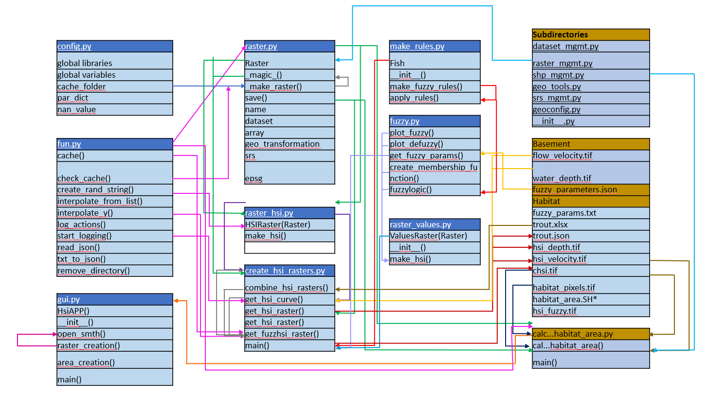
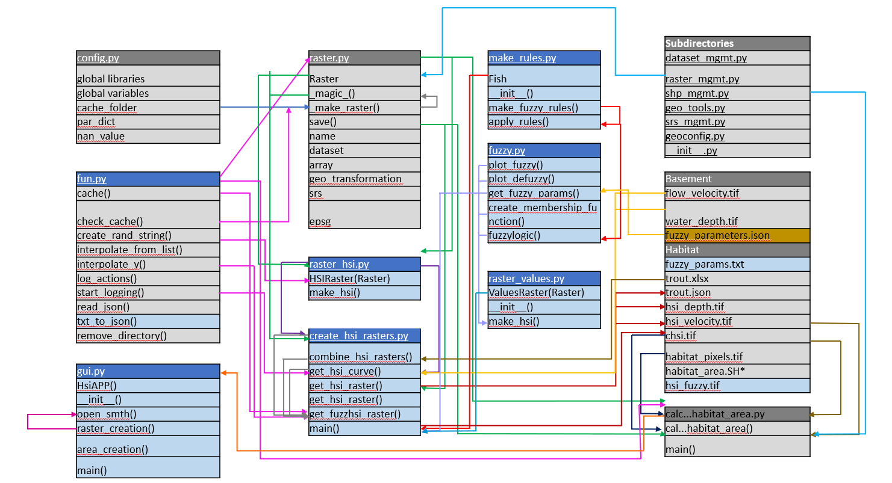

# Implementation of Fuzzy Logic in Habitat Suitability Analysis

***

# Introduction:
> This project is an extension of Exercise 5 from the Hydro-Informatics textbook (Schwindt & Barros, 2007). Throughout 
> stages of their life, aquatic animals, including fish, require different habitat conditions in order to thrive. 
> These habitat conditions include hydraulic parameters such as water depth and flow velocity. Based on these factors a 
> Habitat Suitability Index (HSI) describing the quality of habitat can be defined. HSI values can be calculated using 
> a deterministic approach (as seen in Exercise 5) or a fuzzy logic approach.
> The goal of this project was to create a tool to calculate potential habitat areas for Rainbow Trout in the BLANK 
> river using a fuzzy logic approach. The quality of fuzzy logic analysis is heavily dependent on the expert knowledge 
> used to define fuzzification rules. Fine-tuning of the rules by a fish biologist or other related specialist would 
> improve the quality of the results of this project.
>>*Note: This README.md file contains descriptions of all functions written or altered by the MANT team. To find 
> additional information about the scripts created for the Habitat Suitability Exercise and called here (but not edited by our team) please visit the Hydro-Informatics textbook at
> https://hydro-informatics.com/exercises/ex-geco.html
# Requirements

## Libraries
_Python Libraries:_ geoutils, numpy, pandas, json, skfuzzy, matplotlib.pyplot, geotools, tkinter, PIL

_Standard Libraries:_ os, logging, random, shutil, string

## Input Data

The following data must be and is provided to run the code:

1. The basement folder
   - flow_velocity.tif
   - water_depth.tif

2. The habitat Folder
   - trout.json
   - fuzzy_params.txt
# Instructions to run the code 
1. Run Gui.py to show all results and data
2. Select method and life stage button
3. Plots will appear if plot_fuzzy_example = True. 
4. User must close plots before chsi.tif will display in canvas window 
5. Corresponding chsi.tif will be displayed in canvas window 
6. Next close the plots before clicking calculate habitat area 
7. Calculated habitat area will appear in the results window
8. To display the graph change the boolean value plot_fuzzy_example in the create_hsi_raster main

# Code Diagram

# Code Description

## config.py
All libraries and global variables that are needed are loaded here. The skfuzzy and matplotlib.pyplot packages 
were added in addition to the already existing libraries from Exercise 5.

## fun.py
File where basic functions that are called throughout the script are written.

### txt_to_json
Reads data from .txt file and loads into and saves .json file.
This function was created partially with the help of chat gpt. 

| Input Argument | Type | Description |
| --- | --- | --- |
| file_path | string | path to text file containing fuzzy parameters |
| save_path | string | path to save .json file created from the text file |

## gui.py

#### HsiApp CLASS - AUTHOR: MURAT EGIN
The gui.py contains a class that allows the user to show the habitat suitability of the fish for the selected lifestages.
HsiApp class initializes the tkinter frame utilizing self, master. The layout of the buttons are positioned utilizing the grid layout options. The buttons on the top left allow the user to select a fish lifestage and output the corresponding HSI values in the Python IDE. Below the canvas, the buttons selected allow the user to select the .tiff file that they want to display based on fish lifestage and method.
Functions utilized:

### Open_smth()
Allows the user to open the .tiff file that is generated from the option that they select via the interface. Converts the .tif file to numpy array that allows tkinter to show the image.

| Input argument | Type	   | Description |
|----------------|---------| ----|
| Life_stage	    | String	 | User input lifestage for desired .tif creation and area calculation |
| Method	        | String	 | User input to select method that is run that defines the created raster |
| Canvas	        | string  | 	predefined area that receives the image that is generated from the chsi.tif |

## Raster_Creation()
Button linked function that allows the user to create a chsi.tif based on HSI method and life_stage

|Input argument	| Type    |	Description |
| --- |---------| --- |
| life_stage | 	string |	User input lifestage for desired .tif creation and area calculation |
| Method	| string	 | User input to select method that is run that defines the created raster |

## make_rules.py
File where the Fish class is stored. This class contains the fuzzy rules used to determine the relationship between the
input variables (velocity and depth) and the output variable (HSI value).

### FISH CLASS -- AUTHOR: ANNA CERF
### \_\_init\_\_()
Magic method assigns values to the class attributes when a new object is initiated.

| Input Argument | Type | Description |
| --- | --- | --- |
| common_name | string | common name of fish species being analyzed |
| life_stage | string | life stage of fish to be analyzed for habitat suitability. Must be "fry", "juvenile", "adult", or "spawning"

### make_fuzzy_rules
Establish rules for fuzzification based on velocity and depth characteristics

| Input Argument | Type | Description |
| --- | --- | --- |
| life_stage | string | life stage of fish to be analyzed for habitat suitability |
| habitat_trimf | pd dataframe | results for habitat skfuz triangular membership function generator |
| fuzzy_velocity | dictionary | contains low, medium, and high fuzzy velocity membership |
| fuzzy_depth | dictionary | contains low, medium, and high fuzzy depth membership |

| Return | Type | Description                                                    |
| --- | --- |----------------------------------------------------------------|
| active_rule1 | numpy array | first active rule. To be associated with low habitat value     |
| active_rule2 | numpy array | second active rule. To be associated with medium habitat value |
| active_rule3 | numpy array | third active rule. To be associated with hi habitat value |

### apply_rules
Applies rules based on hydromorphological conditions (velocity and depth).

| Input Value  | Type          | Description                                                    |
|--------------|---------------|----------------------------------------------------------------|
| active_rule1 | numpy array   | first active rule. To be associated with low habitat value     |
| active_rule2 | numpy array   | second active rule. To be associated with medium habitat value |
| active_rule3 | numpy array   | third active rule. To be associated with hi habitat value |
| habitat_trimf | pd data frame | results for habitat skfuz triangular membership function generator |

| Return                | Type | Description                                      |
|-----------------------| --- |--------------------------------------------------|
| habitat_activation_lo | numpy array | fuzzy membership values for low habitat value    |
| habitat_activation_md | numpy array | fuzzy membership values for medium habitat value |
| habitat_activation_hi | numpy array | fuzzy membership values for high habitat value   |

## raster_values.py
Fuzzy logic class which initializes values from GeoTiffs and then runs fuzzy logic for all depth and velocity values. 
It also initializes plotting of fuzzy logic example plot. Inherits Raster class. Class uses raster_hsi as a base template. 

### RasterValues(Raster) - AUTHOR: NIKLAS HENNING

### \_\_init\_\_()
Magic method assigns values to the class attributes when a new object is initiated. 
Converts GeoTiffs into np.array for velocity and depth.
Calls make_fuzzy_hsi

| Input Argument | Type         | Description |
|----------------|--------------| -------------------------------------------------------------------------- |
| file_name      | string       | velocity GeoTiff file name including directory (must end on ".tif")  |
| file_name2     | string       | depth GeoTiff file name including directory (must end on ".tif") |
| fuzzy_parameters | np.array     | inputs for fuzzy logic parameters  |
| fish_class    | class object | rules class for specific fish |
| plot_fuzzy_example    | Boolean      | True or False if plot should be created |

### make_fuzzy_hsi
Loops over array using values from input array variables to run fuzzy logic for each data point, using fuzzy_logic.py
Calls make_fuzzy_plots if plot_fuzzy_example is True

| Input Argument | Type         | Description |
|----------------|--------------| ---- |
| vel      | np.array     | velocity values array  |
| depth    | np.array     | depth values array|
| fuzzy_parameters | np.array     | inputs for fuzzy logic parameters  |
| fish_class    | class object | rules class for specific fish |
| plot_fuzzy_example    | Boolean      | True or False if plot should be created |

| Return              | Type | Description                                                    |
|---------------------| --- |----------------------------------------------------------------|
| make_raster("fuzz") | raster| returns by calling make_raster with np.array habitat values    |

### make_fuzzy_plot
Activates plotting of example fuzzy logic plot. Using plotting functions from fuzzylogic.py

| Input Argument | Type         | Description |
|----------------|--------------| ---- |
| vel      | np.array     | velocity values array  |
| depth    | np.array     | depth values array|
| fuzzy_parameters | np.array     | inputs for fuzzy logic parameters  |
| fish_class    | class object | rules class for specific fish |

## fuzzlogic
Perform fuzzy logic analysis and plot example triangle belonging functions and defuzzification
Tipping skyfuzz example used as template for fuzzylogic https://pythonhosted.org/scikit-fuzzy/auto_examples/plot_tipping_problem.html
### plot_fuzzy
Plots an example of the fuzzified curves for depth, velocity, and HSI parameters

| Input Value  | Type          | Description   |
|--------------|---------------|----------------|
| x_values | dictionary | dictionary with velocity, depth, and habitat values stored as numpy arrays.
| membership | dictionary | dictionary with fuzzy membershi8p functions as pandas dataframes |

 Return                | Type | Description                                      |
|-----------------------| --- |--------------------------------------------------|
| fig | plot | plot depicting fuzzy membership functions |

### plot_defuzzy

 Input Value  | Type           | Description                                                                |
|--------------|----------------|----------------------------------------------------------------------------|
| habitat | numpy.float 64 | final defuzzified habitat suitability index value                          |
|x_values | dictionary     | dictionary with velocity, depth, and habitat values stored as numpy arrays |
| membership | dictioanry     | dictionary with fuzzy membership functions stored as pandas dataframes |
|aggregated | numpy array    | aggregates all three output membership functions together                  |
| habitat_activation | numpy array    | Final degree of membership for graphing                                    |

 Return                | Type | Description                                                               |
|-----------------------| --- |---------------------------------------------------------------------------|
| fig | plot | plot depicting fuzzy membership functions and final defuzzification value |

### get_fuzzy_params
Extract fuzzy parameter information from txt file and save as .json

| Input Value  | Type          | Description   |
|--------------|---------------|----------------|
| file_path | string | file location of text file with fuzzy parameters |

| Return | Type | Description                                                            |
|--------| --- |---------------------------|
| fuzzy_parameters | string | .json file with fuzzy parameter information |

### create_membership_function
 Generates triangle membership functions and saves in dictionary

| Input Value  | Type          | Description   |
|--------------|---------------|----------------|
| fuzzy_parameters | string | .json file with fuzzy parameter information |

| Return | Type | Description                                                            |
|--------| --- |---------------------------|
| membership | dictionary | dictionary with fuzzy membership functions stored as pandas dataframes |
| x_values | dictionary     | dictionary with velocity, depth, and habitat values stored as numpy arrays |

### fuzzylogic

| Input Value  | Type          | Description                          |
|--------------|---------------|--------------------------------------|
| velocity_value | numpy.float64 | given velocity value extracted from tif                |
| depth_value | numpy.float64 | given depth value extracted from tif |
| fish_class | class object | contains functions for making rules |
| membership | dictionary | dictionary with fuzzy membership functions stored as pandas dataframes |
| x_values | dictionary     | dictionary with velocity, depth, and habitat values stored as numpy arrays |

| Return | Type | Description                                                            |
|--------| --- |---------------------------|
| habitat | numpy.float 64 | final defuzzified habitat suitability index value                          |
|aggregated | numpy array    | aggregates all three output membership functions together                  |
| habitat_activation_values | numpy array | Final degree of membership for graphing                                    |
| habitat_activation | numpy array    | Final degree of membership for graphing                                    |

## Auxiliary Components

1. Class inheritance from Raster class to RasterValues
2. Two plotting functions enabled/disabled by boolean (plot_fuzzy and plot_defuzzy)
3. Warning, notes, and errors logged throughout the code
   - create_hsi_raster:
     - logging info in main
     - logging warning in main
     - logging info in main (timer)
   - raster_values
     - logging error x3 in __init__
     - logging warning in make_fuzzy_hsi
     - logging warning in make_fuzzy_plot
4. Implemented GUI

-----------------------------------------------------------